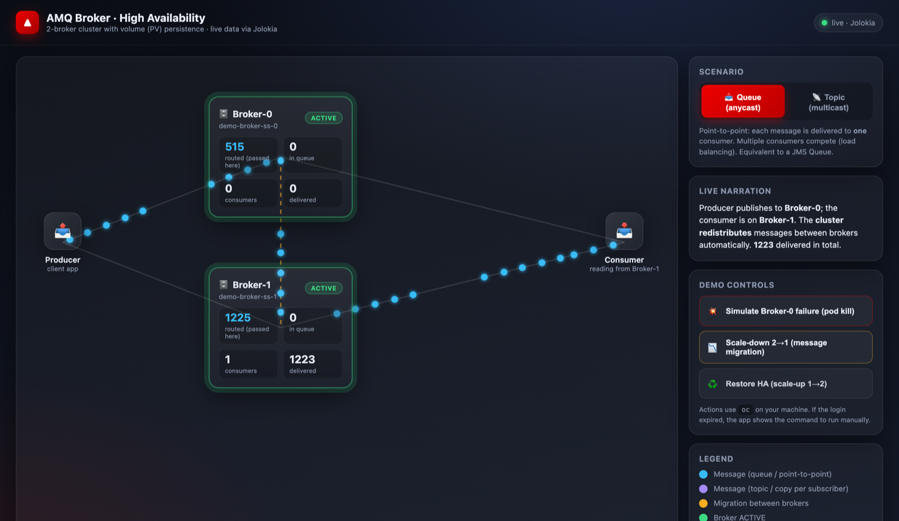
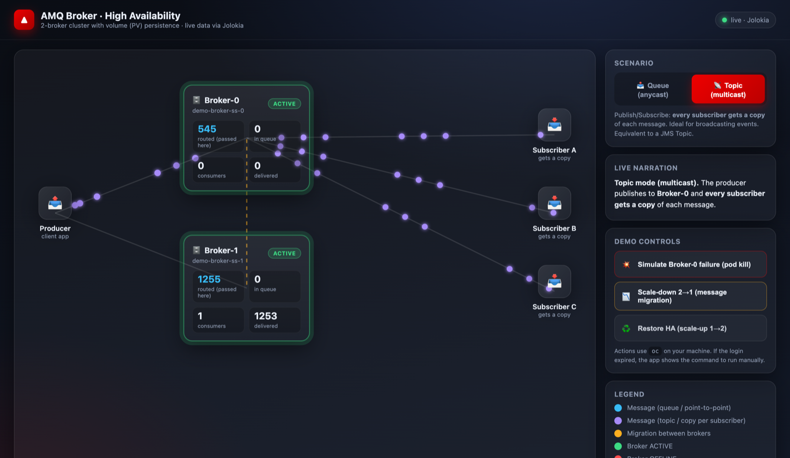
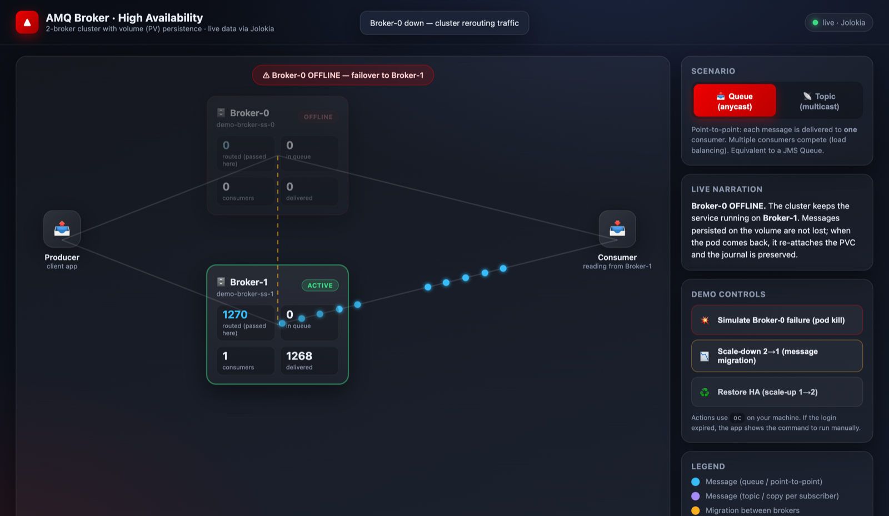
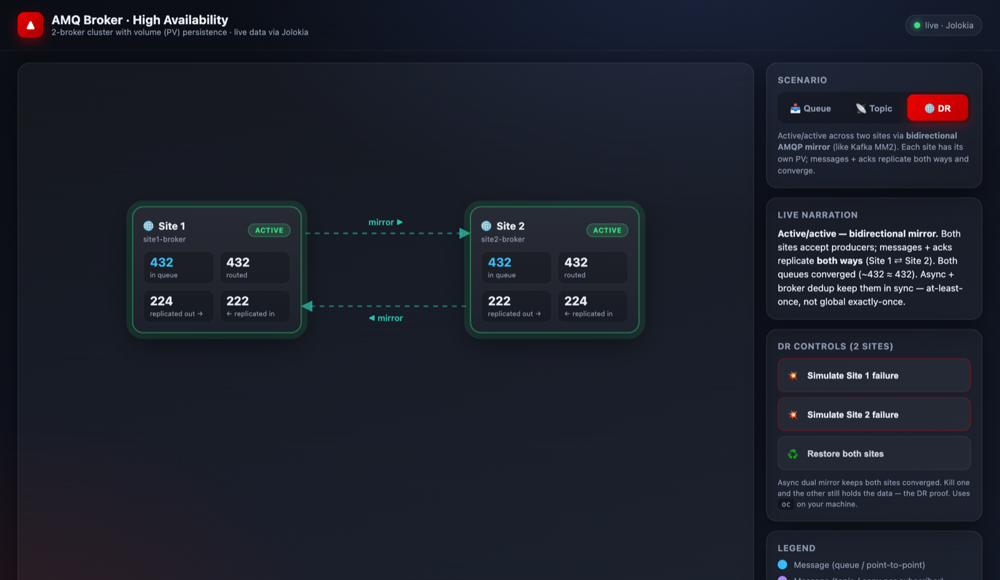
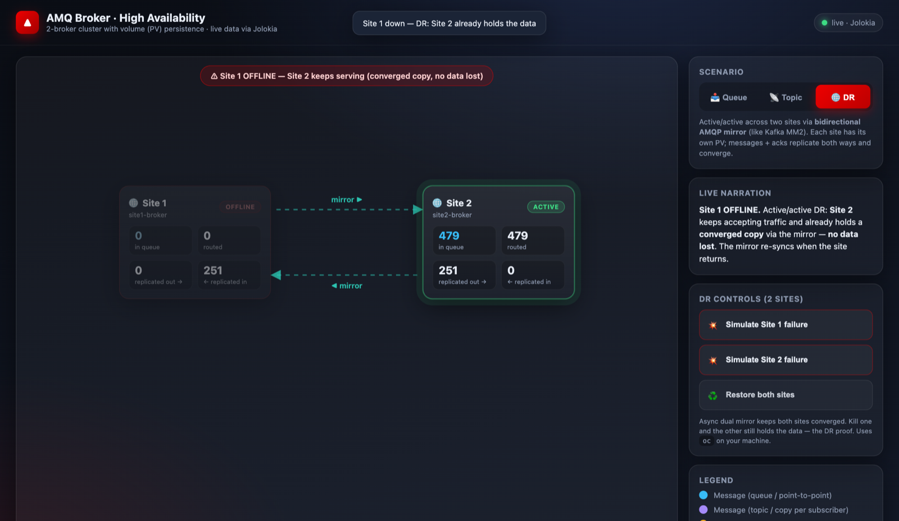

# Red Hat AMQ Broker — High Availability Demos on OpenShift

A complete, hands-on demo kit for **Red Hat AMQ Broker** on OpenShift, built for
solution architects and pre-sales engineers. It ships **two HA scenarios**, the
**producer/consumer apps**, and a **live animated web visualizer** so a customer
can *see* messages flowing, being redistributed between brokers, and surviving a
broker failure.

> Container image: `quay.io/hodrigohamalho/amq-broker-demo`
> Source: https://github.com/hodrigohamalho/amq-broker-demo

---

## What's inside

| Scenario | Persistence | HA model | What it teaches |
|---|---|---|---|
| **A — PV cluster** (`amq-demo`) | File journal on a PVC (per broker) | **Active/Active cluster** + message redistribution & migration | Queues vs Topics, load balancing, message migration, fast client failover |
| **B — JDBC** (`amq-jdbc-demo`) | **PostgreSQL** via JDBC | **Shared-store** (primary/backup, lock in the DB) | When to use a database, shared-store failover, the trade-offs vs the journal |
| **C — DR mirroring** (`amq-dr`) | File journal (per site) | **Async AMQP mirror** to a DR site | Cross-site disaster recovery, warm standby, no data loss on site failure |
| **D — Active/active 2 sites** (`amq-aa`) | File journal (per site) | **Bidirectional (dual) AMQP mirror** | Active/active across sites (like Kafka MM2), convergence, site-failure DR |

> Designing HA/DR? See **[ARCHITECTURE.md](ARCHITECTURE.md)** for the full comparison
> (replication vs clustering vs dual mirror, client failover & external LB).

Plus the **Web Visualizer** that reads each broker's real metrics via Jolokia and
animates the whole story — no `oc` required to *watch* (only to trigger failures).

```
            ┌───────────────────────── OpenShift ─────────────────────────┐
 Producer ──┼──▶ Broker-0 ◀───cluster bridge───▶ Broker-1 ◀──┼── Consumer  │
            │     (PVC)                              (PVC)     │            │
            └───────────────────────────────────────────────────────────-─┘
                          ▲                                   ▲
                          └──────── Web Visualizer (Jolokia) ─┘
```

---

## See it in action

The web visualizer reads **live broker metrics** (via Jolokia) and animates the
whole story — messages flowing, redistribution, fan-out, and failover.

### Queue (anycast) — load balancing & cluster redistribution

The producer publishes to **Broker-0**; the consumer reads from **Broker-1**. The
cluster redistributes messages automatically — note `routed` climbing on *both*
brokers while the dots flow Producer → Broker-0 → Broker-1 → Consumer.

### Topic (multicast) — publish/subscribe fan-out

One publish becomes **a copy for every subscriber** (A, B, C).

### Failover — a broker goes down, the flow keeps running

Broker-0 is **OFFLINE**; the producer and consumer fail over to **Broker-1** and keep
working with **no message loss** (messages persisted on the PVC survive).

### DR mode — active/active across two sites (dual mirror)

Both sites are **ACTIVE** and their queues **converge** (~432 ≈ 432) via the
bidirectional mirror — replication flows both ways (`mirror ▶` / `◀ mirror`).

### DR failover — a site goes down, the other already has the data

**Site 1 OFFLINE**; Site 2 keeps serving and already holds a converged copy — **no
data lost**. The mirror re-syncs when the site returns.

> 💡 No cluster handy? Run the visualizer with `DEMO_DATA=1` to preview the UI with
> realistic synthetic data (the screenshots above were captured that way).

## Prerequisites

- An OpenShift cluster (4.x) and `oc`, logged in with cluster-admin (the demos
  install an Operator). Tested on OpenShift 4.21.
- The **AMQ Broker Operator** is installed automatically by the manifests
  (channel `7.14.x`).
- For the visualizer: **Python 3** (standard library only) *or* `podman`/`docker`.

---

## Scenario A — Active/Active cluster with PV persistence

Two brokers, each with its own PVC, joined in a cluster. The producer publishes to
one broker; the consumer reads from the other; the cluster **redistributes**
messages between them. This is the recommended, high-performance setup.

```bash
oc apply -f manifests/01-operator.yaml        # Operator (Subscription + OperatorGroup)
# wait for the CSV to be Succeeded, then:
oc apply -f manifests/02-broker-ha.yaml        # ActiveMQArtemis: 2 brokers, PVC, anti-affinity, messageMigration
oc apply -f manifests/03-address-queue.yaml    # the demoQueue (anycast)
oc apply -f manifests/04-apps.yaml             # producer + consumer (with client failover)
oc apply -f manifests/05-topic-apps.yaml       # topic producer + 3 subscribers (multicast)
```

Optional — **observability** (Prometheus metrics + a ready-made Grafana dashboard):
```bash
oc apply -f manifests/05-monitoring.yaml     # PodMonitor + RBAC (User Workload Monitoring)
oc apply -f manifests/06-grafana.yaml        # Grafana instance + datasource (Thanos) + AMQ dashboard
```

Key bits of the broker CR (`02-broker-ha.yaml`):
- `deploymentPlan.size: 2` → a 2-broker cluster.
- `persistenceEnabled: true` + `storage` → file journal on a PVC per broker.
- `messageMigration: true` → on scale-down, messages drain to the surviving broker.
- `podAntiAffinity` → brokers land on different nodes (survives a node loss).

## Scenario B — Shared-store HA with PostgreSQL (JDBC)

Two brokers configured as `SHARED_STORE_PRIMARY`, both pointing at the **same
PostgreSQL** database. A lock in the DB decides who is active; the other waits as a
hot backup and takes over on failure. Uses a **custom broker image** that bundles
the PostgreSQL JDBC driver.

```bash
oc apply -f manifests/jdbc/01-operator.yaml    # Operator in the amq-jdbc-demo namespace
oc apply -f manifests/jdbc/02-postgres.yaml    # PostgreSQL (Deployment + PVC + Secret)
# build the broker image that contains the JDBC driver:
oc new-build --name amq-broker-postgres --binary --strategy=docker -n amq-jdbc-demo
oc start-build amq-broker-postgres --from-dir=build/jdbc -n amq-jdbc-demo --follow
oc apply -f manifests/jdbc/03-broker-jdbc.yaml # ActiveMQArtemis with storeConfiguration=DATABASE + HA
oc apply -f manifests/jdbc/04-queue-apps.yaml  # producer + consumer (shared-store failover URLs)
```

How JDBC + HA is wired (via `spec.brokerProperties`):
```
storeConfiguration=DATABASE
storeConfiguration.jdbcDriverClassName=org.postgresql.Driver
storeConfiguration.jdbcConnectionUrl=jdbc:postgresql://postgres:5432/artemis?user=artemis&password=artemis
HAPolicyConfiguration=SHARED_STORE_PRIMARY
```

> ⚠️ With a **single shared database** you get **active/passive** (one broker serves
> at a time). You cannot have multiple active brokers sharing the same tables — the
> node-manager lock guarantees a single owner. For active/active you would need a
> separate database/schema per broker.

---

## Scenario C — Disaster Recovery via AMQP Mirroring

A **primary** broker (Site A) asynchronously **mirrors** everything — messages,
acknowledgements, and queue create/remove — to a **DR** broker (Site B) over an AMQP
broker connection. The DR broker keeps a warm copy of the data, so if the primary
site is lost you recover from it with no message loss. In production the two brokers
live in separate clusters/sites; here two CRs in the `amq-dr` namespace illustrate it.

```bash
oc apply -f manifests/dr/01-operator.yaml      # Operator in the amq-dr namespace
oc apply -f manifests/dr/02-brokers-dr.yaml    # dr-primary (mirror) + dr-backup + queue
oc apply -f manifests/dr/03-apps.yaml          # producer + consumer on the primary
oc apply -f manifests/dr/04-console-routes.yaml
```

The mirror is configured on the primary via `spec.brokerProperties`:
```
AMQPConnections.dr.uri=tcp://dr-backup-all-0-svc.amq-dr.svc.cluster.local:61616
AMQPConnections.dr.connectionElements.mirror.type=MIRROR
AMQPConnections.dr.connectionElements.mirror.messageAcknowledgements=true
AMQPConnections.dr.connectionElements.mirror.queueCreation=true
```

**Demo it:**
```bash
./scripts/dr-failover.sh
```
It pauses the consumer so messages pile up (and mirror to the DR broker), shows the
**same messages on both brokers**, simulates the **loss of the primary site**, and
**recovers by consuming from the DR broker** — proving zero data loss — then restores
the primary.

> Mirroring is **asynchronous and one-way** (Site A → Site B): ideal for DR / warm
> standby, not a synchronous replica. After a real failover, *failback* (re-syncing
> Site A) is a deliberate, separate step. For in-cluster HA, use Scenario A.

## Scenario D — Active/Active across two sites (dual mirror)

Two sites, each with its **own PV**, replicating to each other with a **bidirectional
(dual) AMQP mirror**. Both sites accept producers; messages **and** acknowledgements
are mirrored **both ways**, so the two queues **converge**. Loop prevention and
broker-side duplicate detection are automatic. This is the AMQ equivalent of a Kafka
MirrorMaker 2 active/active setup.

```bash
oc apply -f manifests/active-active/01-operator.yaml      # Operator in the amq-aa namespace
oc apply -f manifests/active-active/02-brokers.yaml        # site1-broker <== dual mirror ==> site2-broker
oc apply -f manifests/active-active/03-apps.yaml           # a producer on EACH site
oc apply -f manifests/active-active/04-console-routes.yaml
```

The mirror is configured on each broker via `spec.brokerProperties`, e.g. on site 1:
```
AMQPConnections.toSite2.uri=tcp://site2-broker-all-0-svc.amq-aa.svc.cluster.local:61616
AMQPConnections.toSite2.connectionElements.mirror.type=MIRROR
AMQPConnections.toSite2.connectionElements.mirror.messageAcknowledgements=true
```
(site 2 has the symmetric `toSite1` connection.)

**Demo it** in the visualizer's **DR mode** (see below): both queues stay converged;
click *Simulate Site 1 failure* and Site 2 keeps serving with a converged copy — no
data lost. Then *Restore both sites* and the mirror re-syncs.

> ⚠️ The mirror is **asynchronous** → with consumers on both sites you get
> at-least-once with a possible duplicate window (same trade-off as Kafka MM2), **not**
> global exactly-once. Use idempotent consumers / dedup. Full discussion in
> [ARCHITECTURE.md](ARCHITECTURE.md).

## The Web Visualizer

A live, animated view of the cluster. It reads each broker's real metrics via
**Jolokia** (the console's management API) over the HTTPS routes — so it keeps
working even if your `oc` token has expired.

### Run with Python (no dependencies)
```bash
cd webapp
python3 server.py
# open http://localhost:8080
```

### Run as a container
```bash
podman run --rm -p 8080:8080 \
  -e BROKER0_CONSOLE=https://<broker-0-console-route> \
  -e BROKER1_CONSOLE=https://<broker-1-console-route> \
  quay.io/hodrigohamalho/amq-broker-demo:latest
# open http://localhost:8080
```

All settings are environment variables (see [`webapp/README.md`](webapp/README.md)).
The two `Scenario` modes (**Queue** / **Topic**) and the **demo control buttons**
(kill / scale) are in the right-hand panel.

---

## 🎤 How to run the demo (talk track)

Open the visualizer and keep `oc get pods -n amq-demo -w` handy in a terminal.

### 1. "It's all declarative" (1 min)
Show `manifests/02-broker-ha.yaml`. Point out `size: 2`, `persistenceEnabled`,
`messageMigration`, `podAntiAffinity`. **Message:** HA is configuration, not custom code.

### 2. "Real apps producing and consuming" — Queue mode (2 min)
In the visualizer, stay on **Queue (anycast)**.
- The **Producer** publishes to **Broker-0**; the **Consumer** reads from **Broker-1**.
- Watch the **routed** counter climb on *both* brokers and the dots flow
  Producer → Broker-0 → Broker-1 → Consumer.
- **Message:** the producer and consumer talk to *different* brokers, yet every
  message is delivered — **the cluster redistributes automatically**.

> 💡 Why does Broker-0 show `routed` going up but `in queue = 0`? Because with
> **ON_DEMAND** load balancing it forwards messages to Broker-1 (where the consumer
> is) through the cluster **store-and-forward** bridge, instead of keeping them in
> its local queue. `routed` = "passed through here", which is the honest throughput.

### 3. Pub/Sub — Topic mode (2 min)
Switch to **Topic (multicast)**.
- One publish becomes **a copy for every subscriber** (A, B, C) — fan-out.
- **Message:** Queue = point-to-point (one consumer per message);
  Topic = publish/subscribe (every subscriber gets a copy).

### 4. ⭐ The HA moment — kill a broker (3 min)
Keep the visualizer visible and click **Simulate Broker-0 failure** (or run
`./scripts/failover-demo.sh`).
- Broker-0 turns **OFFLINE**, a banner appears.
- The **producer fails over to Broker-1 in a few seconds** and keeps publishing;
  the consumer never stops. Messages persisted on the PVC are **not lost**.
- Broker-0's pod is rescheduled, **re-attaches the same PVC**, and rejoins.
- **Message:** *"This is a 3 a.m. node failure that nobody had to wake up for."*

### 5. Message migration — scale down (2 min)
Click **Scale-down 2→1**. With `messageMigration: true`, the messages on the
removed broker **migrate** to the survivor (no loss). Then **Restore HA (2)**.

### 6. (Optional) The JDBC contrast (3 min)
Switch to the `amq-jdbc-demo` namespace. Kill the active broker and show the
**shared-store failover**: the backup acquires the lock in PostgreSQL (~10–25s,
tunable) and takes over. **Message:** same client failover mechanics, different HA
model — pick the journal for performance, JDBC only when a central RDBMS is a
hard requirement.

---

## Concepts cheat-sheet (for customer Q&A)

**Queue (anycast) vs Topic (multicast)**
- *Queue*: each message → **one** consumer; multiple consumers compete (load balancing). JMS Queue.
- *Topic*: each subscriber gets **a copy** of every message (fan-out). JMS Topic.

**HA models**
- *Active/Active cluster (PV)*: both brokers live, each with its own store; the
  cluster load-balances and redistributes. Client failover is fast (~seconds).
- *Shared-store (JDBC or RWX)*: primary/backup; one active at a time; a lock decides
  the owner. Failover also waits for the backup to **acquire the lock**.

**Client failover (the key detail)**
- Give the client a **connector list** of both brokers, e.g.
  `(tcp://broker-0,tcp://broker-1)?reconnectAttempts=3&...`.
- Use a **finite** `reconnectAttempts` (not `-1`). With `-1` the client keeps
  retrying the **dead** node forever and never moves on. A finite value makes it
  give up quickly and reconnect to the survivor (we wrap the client in a loop too).

**Persistence: journal vs JDBC** — the file journal is the high-performance default;
JDBC is supported but slower (DB write overhead). Choose JDBC for governance/central
RDBMS requirements, accepting the throughput trade-off.

---

## Repository layout

```
manifests/                 Scenario A (PV cluster) — Operator, broker, queue, apps, topic
manifests/jdbc/            Scenario B (JDBC/PostgreSQL shared-store)
manifests/dr/              Scenario C (Disaster Recovery via AMQP mirroring)
manifests/active-active/   Scenario D (active/active two sites, dual mirror)
ARCHITECTURE.md            HA & DR design guide (replication vs clustering vs mirror)
build/jdbc/Dockerfile      Custom broker image with the PostgreSQL JDBC driver
scripts/                   Helper scripts (queue-stats, failover-demo, cleanup)
webapp/                    The live visualizer (server.py + index.html + Containerfile)
```

## Cleanup

```bash
./scripts/cleanup.sh         # remove apps, queue, broker (Scenario A)
./scripts/cleanup.sh --all   # also remove the Operator and namespace
# Scenario B:
oc delete project amq-jdbc-demo
# Scenario C:
oc delete project amq-dr
# Scenario D:
oc delete project amq-aa
```

---

## License

Apache-2.0. Red Hat, AMQ, and OpenShift are trademarks of Red Hat, Inc. This is a
community demo, not an official Red Hat product.
